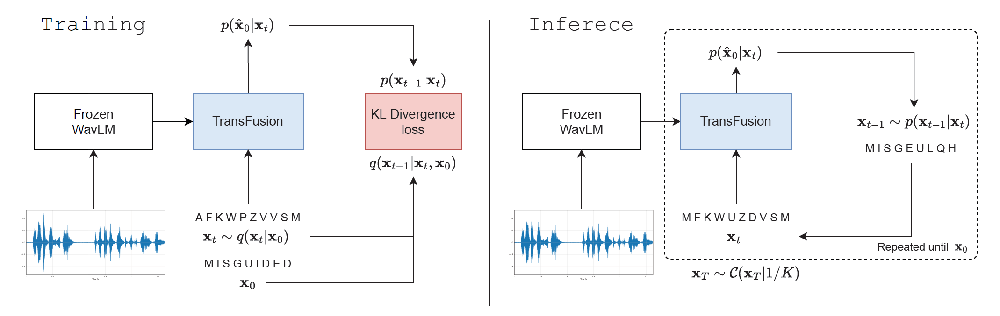

# TransFusion: Transcribing Speech with Multinomial Diffusion

The official code repo! This repo contains code for training, inference, and scoring of TransFusion ASR models from our paper, "_TransFusion: Transcribing Speech with Multinomial Diffusion_".
The trained checkpoints are available under the ['Releases' tab](https://github.com/RF5/transfusion-asr/releases), although the quickstart below will download them for you. Hope you find this useful!

Links:

- arXiv: [https://arxiv.org/abs/2210.07677](https://arxiv.org/abs/2210.07677)
- SACAIR 2022 proceedings: coming soon



Figure: the TransFusion diagram showing both training and inference, as given in the paper. 

Authors:

- [Matthew Baas](https://rf5.github.io/)
- [Kevin Eloff](https://kevineloff.github.io/)
- [Herman Kamper](https://www.kamperh.com/)

---

## Quickstart

We use torch hub to make model loading very easy -- no cloning of the repo needed!
The steps to perform ASR inference with the trained checkpoint is simple:

1. **Instal pip dependancies**: ensure `torch`, `torchaudio`, `numpy`, `omegaconf`, `fairseq`, `fastprogress`, `jiwer`, and `pandas` are installed (for full training dependencies see `requirements.txt`). Make sure you are using **python 3.10 or above**, this repo uses certain new features of python 3.10.
2. **Load models**: load the trained TransFusion model and frozen WavLM encoder:
  ```python
  import torch
  import torchaudio

  device = 'cpu' # or 'cuda' if you have enough GPU memory.
  wavlm = torch.hub.load('RF5/transfusion-asr', 'wavlm_large', device=device)
  transfusion = torch.hub.load('RF5/transfusion-asr', 'transfusion_small_462k', device=device)
  ```
3. **Compute WavLM features**: load a 16kHz waveform and compute the WavLM features:

  ```python
  path = '<path to arbitrary 16kHz waveform>.wav'
  x, sr = torchaudio.load(pth)
  assert sr == 16000
  # get weighted WavLM features:
  features = wavlm.extract_transfusion_features(x.to(device), wavlm) # (seq_len, dim)
  ```
4. **Predict transcript**: Perform multinomial diffusion using all the additional techniques from the paper:

  ```python
  pred_inds, pred_text = transfusion.perform_simple_inference(
      transfusion, # pass in model to use in diffusion
      features[None],  # add batch dimension to features
      transfusion.diffuser, # diffuser containing diffusion parameters
      transfusion.vocab, # vocab for converting indices to text / text to indices
      transfusion.cfg # model/diffusion config dict
  )
  print(pred_text)
  # prints out the predicted transcript of your utterance!
  ```

That's it, trivial!
You can modify the diffusion parameters using the `DSH` class in `transfusion/score.py` and in the diffuser config. By default it uses the optimal settings found in the paper. 


## Checkpoints

Under the releases tab of this repo we provide two checkpoints:

- The frozen WavLM encoder taken from the original WavLM authors, which we host here for convenience and torch hub integration.
- The best TransFusion model presented in the paper, i.e. the model trained for 462k updates. 

The performance on the Librispeech test set is summarized:

| checkpoint | Params (M)| LS test-clean WER (%) | LS test-other WER (%) |
| ----------- | :----: | :-----------: | :----: | 
| `transfusion_small_462k`   | 253 | 6.7 | 8.8 | 

## Training

For training you must also install [`deepspeed`](https://www.deepspeed.ai/).

### Preparing data

Before training, one needs to prepare the data. The steps to do that for the LibriSpeech dataset is:

1. First download and extract the [LibriSpeech](http://www.openslr.org/12) dataset. 

2. Then extract the WavLM features with the `extract.py` script:

  ```
  usage: python -m wavlm.extract [--librispeech_path PATH/TO/LIBRESPEECH] [--ckpt_path PATH/TO/WAVLM_LARGE_CKPT] [--out_path PATH/TO/FEAT]

  required arguments:
      --librispeech_path          root path of librispeech dataset
      --out_path                  target directory to save WavLM features into
      --ckpt_path                 path to pretrained WavLM checkpoint

  optional arguments:
      --seed 
      --device                    
  ```

3. Split data into train, validation, and test splits using `split_data.py` script:

  ```
  usage: split_data.py --librispeech_path LIBRISPEECH_PATH --ls_wavlm_path LS_WAVLM_PATH [--include_test]

  Generate train & valid csvs from dataset directories

  options:
    --librispeech_path LIBRISPEECH_PATH
                          path to root of librispeech dataset
    --ls_wavlm_path LS_WAVLM_PATH
                          path to root of WavLM features extracted using extract.py
    --include_test        include processing and saving test.csv for test subsets
  ```
  
  Running this will save the train/valid/test csv files and a vocabulary dict as `vocab.pt` into a `./splits/` folder.

Now you are ready to get training!

### Training

The training, model, and distributed computing config is specified in `transfusion/config`, `deepspeed_cfg.json`, and `train.py`.
To train the model according to the paper specification, use the following deepspeed command to train using `train.py`:

```
deepspeed --num_nodes 1 train.py train_csv=splits/train.csv valid_csv=splits/valid.csv  checkpoint_path=runs/pog-debug/ vocab_path=splits/vocab.pt batch_size=12  --deepspeed --deepspeed_config=deepspeed_cfg.json validation_interval=20000 checkpoint_interval=20000
```

That's it! Now both logs and checkpoints will be saved into the `checkpoint_path` and the `output_path` specified in `deepspeed_cfg.json`.

You can get a detailed score of a trained checkpoint using the `transfusion/score.py` script (see its help message for usage), which is what is used to perform the final Librispeech evaluations. It contains all the special decoding strategies introduced in the paper as well as the main decoding hyperparameters.

### Repository structure:

The repository is organized as follows:


```
├── transfusion
│   ├── config.py                   # hyperparameters
│   ├── dataset.py                  # data loading and processing
│   ├── diffusion.py                # diffusion helper functions
│   ├── eval.py                     # logging and evaluation metrics
│   ├── model.py                    # model definition
│   ├── score.py                    # evaluation function
│   ├── utils.py                    # training helper functions
│   └── wavlm_modules.py            # wavlm model modules (from original WavLM repo)
├── wavlm
│   ├── extract.py                  # wavlm feature extraction script
│   ├── modules.py                  # wavlm helper functions (from original WavLM repo)
│   └── WavLM.py                    # wavlm modules (from original WavLM repo)
├── deepspeed_cfg.json              # deepspeed config
├── hubconf.py                      # torchhub integration
├── README.md
├── requirements.txt
├── split_data.py                   # splits data into train/valid/test subsets
├── train.py                        # main training script
└── TransFusion.png                 # TransFusion model
```


## Acknowledgements

Parts of code for this project are adapted from the following repositories -- please make sure to check them out! Thank you to the authors of:

- https://github.com/andreas128/RePaint
- https://github.com/ehoogeboom/multinomial_diffusion
- https://github.com/microsoft/unilm/tree/master/wavlm

<!-- All experiments were performed on Stellenbosch University's High Performance Computing (HPC) cluster. -->

## Citation


```bibtex
@inproceedings{baas2022transfusion,
  title={TransFusion: Transcribing Speech with Multinomial Diffusion},
  author={Baas, Matthew and Eloff, Kevin and Kamper, Herman},
  booktitle={SACAIR},
  year=2022
}
```
